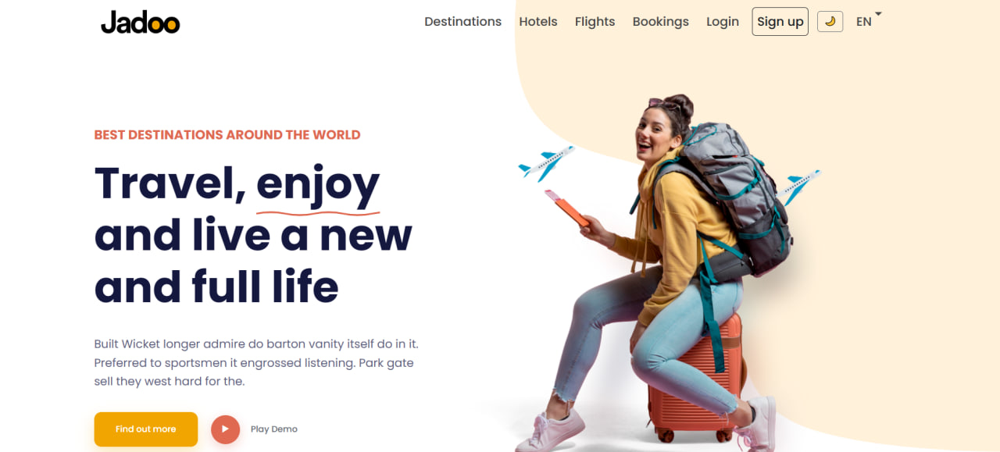

# Jadoo - Travel Website Project

This is a front-end project for "Jadoo," a modern travel agency website. It's built from scratch using pure HTML, CSS, and JavaScript, with Bootstrap 5 for the responsive grid system.

### [Live Demo](https://leenoyoon.github.io/jadoo/)

*(Please replace the link above with your actual GitHub Pages URL)*

## Screenshot



*(To add this screenshot, take a picture of your project, name it `screenshot.jpg`, and place it in the same folder as this `README.md` file.)*

## Features

* **Fully Responsive Design:** Adapts to all screen sizes, from mobile to desktop, using Bootstrap's grid.
* **Dark/Light Mode:** A theme toggler that saves the user's preference in `localStorage`.
* **Bilingual Support (EN/AR):** A language switcher that translates the UI and handles RTL (Right-to-Left) layout for Arabic.
* **Modern UI/UX:** Clean design with custom-styled components, hover effects, and layered elements using `position`.
* **Clean Code:** Organized CSS with CSS Variables (for easy theme management) and modular JavaScript.

## Technologies Used

* HTML5
* CSS3 (Flexbox, Grid, CSS Variables, Pseudo-elements)
* Bootstrap 5
* JavaScript (ES6+)

## How to Run Locally

1.  **Clone the repository:**
    ```bash
    git clone [https://github.com/leenoyoon/jadoo.git](https://github.com/leenoyoon/jadoo.git)
    ```
2.  **Navigate to the project folder:**
    ```bash
    cd jadoo
    ```
3.  **Open the file:**
    Simply open the `index.html` file in your favorite browser. No build steps are needed.